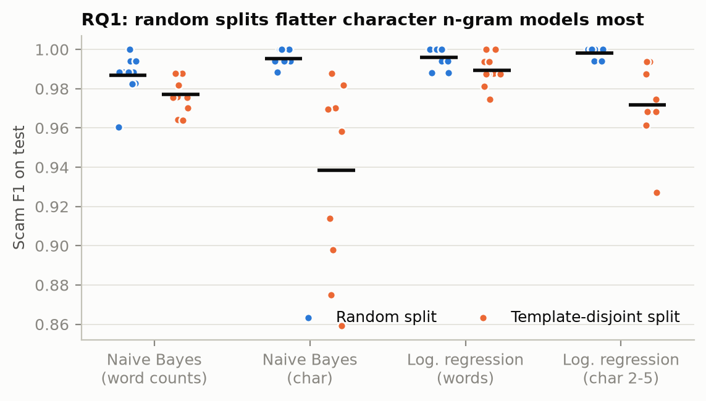
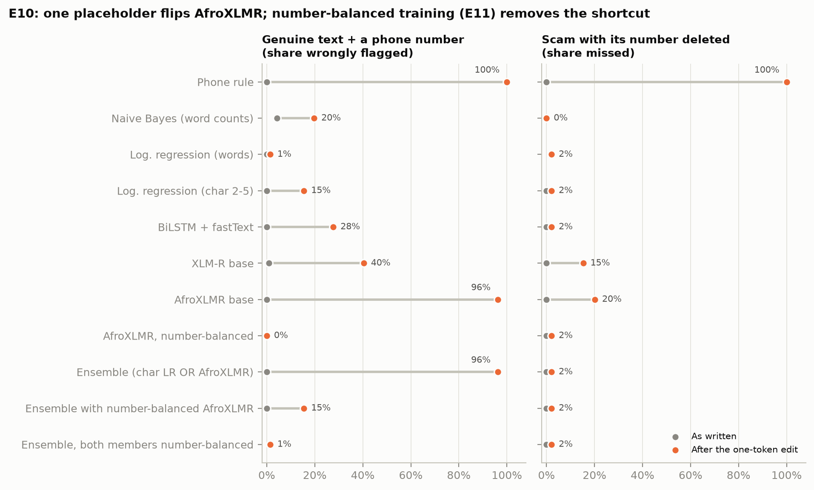
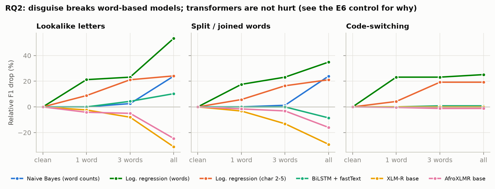
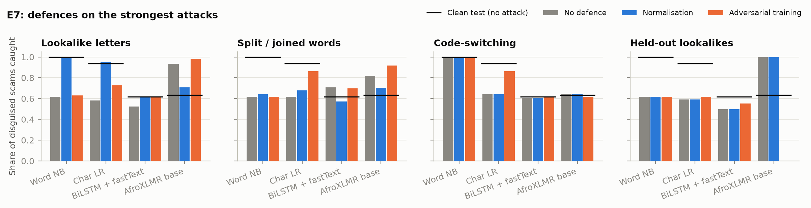
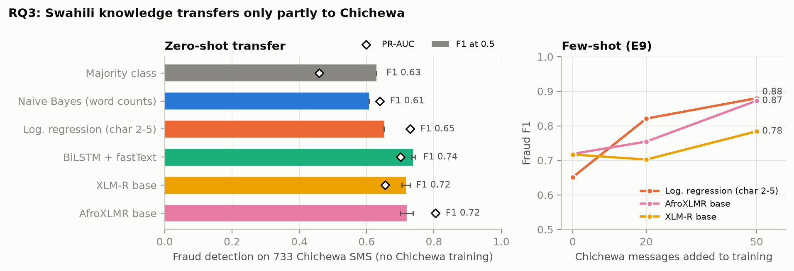

# WDYRI: Why Did You Redeem It?

**Swahili mobile-money scam detectors look near-perfect. We show they are often right for the wrong reason, measure how much, and reduce it.**

| | |
| --- | --- |
| GitHub repository | https://github.com/supserrr/wdyri |
| Live app | https://huggingface.co/spaces/supserrr/wdyri (runs in your browser) |
| Fine-tuned model | https://huggingface.co/supserrr/wdyri-afroxlmr |
| Demo video | *to be added* |
| Fallback demo | [notebooks/colab_app.ipynb](notebooks/colab_app.ipynb) (runs the same app on Colab with a public link) |

Mobile-money scams arrive as SMS that pose as relatives, agents, landlords or employers and ask the victim to send money; in Tanzania a common hook is *"ni tumie kwa namba hii"* (send it to me on this number). Published Swahili detectors report 98.7% (BongoScam) to 99.86% (Mambina et al., 2022) accuracy. WDYRI reproduces that result and then asks what prior work skipped:

1. **RQ1, leakage.** How much of the score survives when near-duplicate scam templates cannot appear in both train and test?
2. **RQ2, robustness.** How far does each model fall under rule-based obfuscation (lookalike letters, split words, English code-switching), and do simple defences recover it?
3. **RQ3, transfer.** Can a model trained only on Swahili catch real Chichewa fraud SMS from Malawi, and does Africa-centric pretraining (AfroXLMR) beat plain XLM-R there?

Answering them raised a fourth question, which became the project's main contribution: **what are these models actually reading?**

**Users:** mobile-money customers checking a suspicious SMS, and the telcos or fintechs that could run the check for them.

### Why Swahili, and is the task already solved?

The brief's "no established system" rule is written for machine translation (Swahili has established MT, so it would be barred there). For text classification the matching question is whether *this task in this language* is already solved by an established system. We checked every Swahili scam-SMS detector we could find:

| Existing work | What exists | Why it does not settle the task |
| --- | --- | --- |
| Mambina et al. (2022) | 99.86% accuracy, random forest | Data not public; scams under 1% of messages; no robustness or transfer test |
| BongoScam (Dioniz, 2024) | public data + Naive Bayes app, 98.7% | One random split; we show its scores rest partly on a phone-number shortcut (E3b, E10) |
| Njame et al. (2026) | F1 about 0.998 | In-distribution only |
| Chiuseni et al. (2026) | obfuscation study | LLM-written attacks; defences proposed, not tested; English-Swahili only |
| Taylor & Robert (2025a) | Chichewa fraud SMS, about 97% | Classical models; no cross-language transfer |

No public, robustly evaluated Swahili scam classifier exists, and none for Chichewa beyond classical in-language models. Swahili is chosen because it has public, real-world scam SMS and the most published detectors to test against; Chichewa extends the question to a lower-resource neighbour that XLM-R never saw in pretraining.

## What is new here

1. **A shortcut, found and measured.** In BongoScam, 86% of scams and 0% of genuine texts contain a phone number or link; the fixed rule "has a number" scores F1 0.92 on the whole dataset. Minimal-pair stress tests (E10) show the cost: appending a phone number to a genuine message makes fine-tuned AfroXLMR call it a scam **96%** of the time, and deleting the number from a scam makes it miss **20%**.
2. **A targeted fix.** Number-balanced counterfactual training (E11) edits one token in 42% of training texts so that a number appears about equally often in both classes. AfroXLMR's stress-test false alarms fall from 96% to **0%** and its misses from 20% to **2%**; its test PR-AUC rises from 0.958 to 0.985 (the F1 gain, 0.78 to 0.82, is not significant, p = 0.06). The fix has costs: for AfroXLMR, lower Chichewa precision; for the char LR and BiLSTM, weaker resistance to lookalike letters; and the number-balanced AfroXLMR flags disguised genuine texts more often.
3. **Leakage-safe evaluation.** Template-disjoint splits, ten re-drawn splits per protocol, a per-template view, seed-pooled bootstrap intervals and paired significance tests, instead of one random split.
4. **Reproducible attacks with controls and a second attacker.** Three rule-based attacks at three intensities, two tested defences, control sets that disguise *genuine* texts the same way, and a second attacker model. The controls show that the transformers' resistance to disguise is largely suspicion of odd-looking text: fully disguised genuine texts are flagged 54-93% of the time.
5. **A complementary ensemble, checked out of sample and chosen on validation.** A character n-gram model and AfroXLMR fail on different messages; flagging when either flags (both members number-balanced, chosen on validation stress tests) scores test F1 0.994 and keeps 0.95-0.99 under lookalike and split-word attacks from either attacker (+0.22 to +0.23 over the char LR, p < 0.001). On two fresh splits it beats AfroXLMR by 0.20-0.22 (p < 0.001) and matches the char LR (+0.02-0.03, not significant). It is the deployed app.
6. **Swahili to Chichewa transfer.** Zero-shot transfer is weak: trained models reach fraud F1 0.46-0.74, and a 9-word length rule scores 0.72. AfroXLMR ranks Chichewa fraud better than XLM-R (PR-AUC +0.15, p < 0.001) and adapts faster from 50 examples (F1 0.87 vs 0.78, p < 0.001), but a char LR without pretraining adapts just as fast (0.88).

## Findings in one minute

* **E1:** the published 98.7% reproduces exactly (98.68% accuracy).
* **RQ1:** over 10 re-drawn splits, keeping templates out of the test costs character n-gram models 2.6-5.7 F1 points (char LR 0.998 → 0.972, char NB 0.995 → 0.938) and word models about 1 point or less; all four gaps are significant (Mann-Whitney p ≤ 0.02). The bigger effect is *which* scripts land in the test: one unseen landlord-impersonation script (31 of 81 test scams; no number, link or amount) is caught by word NB (31 of 31) and word LR (29 of 31) but not by the transformers (0-13%), whose test F1 is 0.76-0.78 while their per-template F1 is 0.98-0.99.
* **RQ2:** lookalike letters cut word-level LR recall from 0.96 to 0.30; normalisation restores it to 0.95 (+0.52 F1, p < 0.001) at no cost on clean text, but only partly repairs split words. The transformers lose nothing under disguise, but the controls show why: at full intensity they also flag disguised *genuine* texts (AfroXLMR 54-60%, XLM-R 93%), and the scams AfroXLMR catches only once disguised are mostly the landlord script it misses when clean. The char LR never flags disguised genuine texts but loses 21-24% of its F1. Results are the same with a second attacker. Code-switching is the attack normalisation cannot undo; adversarial training cuts the char LR's loss there from 19% to 4%.
* **RQ3:** zero-shot fraud F1 on 733 Chichewa SMS is 0.46-0.74 for trained models, against 0.68 for the phone rule and 0.72 for the length rule. AfroXLMR's ranking advantage over XLM-R is significant, but a random-initialised BiLSTM ranks as well (PR-AUC 0.80), so African pretraining is not the only route. Twenty Chichewa examples lift char LR from 0.65 to 0.82 on the same messages.
* **The shortcut:** removing it changes what transfers. Number-balanced AfroXLMR keeps its Chichewa F1 (0.72) but loses precision (-0.06, p < 0.001); number-balanced char LR loses most of its transfer (0.65 → 0.15): for the classical models, "contains a number" *was* the transfer.

## Main results

Template-disjoint split (no scam script in both train and test). Full tables for every experiment, with significance tests: [results/tables.md](results/tables.md).

<!-- RESULTS:START -->
| Model | Test F1 | 95% CI | Test F1 (per template) | Test PR-AUC | Precision (op.) | Recall (op.) | Chichewa F1 (zero-shot) | Chichewa PR-AUC |
|---|---|---|---|---|---|---|---|---|
| Majority class | 0.695 | [0.62, 0.76] | 0.585 | 0.533 | 0.533 | 1.000 | 0.629 | 0.458 |
| Phone rule | 0.744 | [0.66, 0.82] | 0.969 | 0.810 | 1.000 | 0.593 | 0.681 | 0.692 |
| Length rule | 0.850 | [0.79, 0.90] | 0.774 | 0.747 | 0.752 | 0.975 | 0.724 | 0.573 |
| Naive Bayes, word counts | 0.982 | [0.96, 1.00] | 0.971 | 1.000 | 0.964 | 1.000 | 0.608 | 0.648 |
| Naive Bayes, char 2-5 | 0.953 | [0.91, 0.98] | 0.926 | 0.991 | 0.910 | 1.000 | 0.683 | 0.738 |
| Log. regression, word 1-2 | 0.981 | [0.96, 1.00] | 0.990 | 1.000 | 1.000 | 0.963 | 0.456 | 0.727 |
| Log. regression, char 2-5 | 0.968 | [0.94, 0.99] | 1.000 | 1.000 | 1.000 | 0.938 | 0.651 | 0.730 |
| BiLSTM, random init | 0.791 ± 0.027 | [0.71, 0.86] | 0.990 ± 0.000 | 0.966 ± 0.046 | 1.000 ± 0.000 | 0.654 ± 0.037 | 0.597 ± 0.063 | 0.803 ± 0.026 |
| BiLSTM, fastText frozen | 0.778 ± 0.018 | [0.70, 0.85] | 0.983 ± 0.006 | 0.981 ± 0.005 | 0.987 ± 0.011 | 0.642 ± 0.021 | 0.733 ± 0.005 | 0.645 ± 0.031 |
| BiLSTM, fastText fine-tuned | 0.860 ± 0.107 | [0.81, 0.90] | 0.980 ± 0.017 | 0.990 ± 0.007 | 0.980 ± 0.024 | 0.778 ± 0.174 | 0.738 ± 0.005 | 0.701 ± 0.100 |
| XLM-R base | 0.759 ± 0.007 | [0.67, 0.83] | 0.983 ± 0.011 | 0.871 ± 0.035 | 0.987 ± 0.022 | 0.617 ± 0.000 | 0.717 ± 0.012 | 0.654 ± 0.090 |
| AfroXLMR base | 0.776 ± 0.021 | [0.70, 0.84] | 0.990 ± 0.000 | 0.958 ± 0.038 | 1.000 ± 0.000 | 0.634 ± 0.029 | 0.719 ± 0.019 | 0.805 ± 0.042 |
| AfroXLMR base, number-balanced (E11) | 0.820 ± 0.035 | [0.75, 0.88] | 0.990 ± 0.000 | 0.985 ± 0.015 | 1.000 ± 0.000 | 0.696 ± 0.050 | 0.716 ± 0.033 | 0.649 ± 0.005 |
| Ensemble: char LR OR AfroXLMR | 0.968 ± 0.000 | [0.94, 0.99] | 1.000 ± 0.000 | 1.000 ± 0.000 | 1.000 ± 0.000 | 0.938 ± 0.000 | 0.720 ± 0.018 | 0.805 ± 0.043 |
| Ensemble: char LR OR number-balanced AfroXLMR | 0.968 ± 0.000 | [0.94, 0.99] | 1.000 ± 0.000 | 1.000 ± 0.000 | 1.000 ± 0.000 | 0.938 ± 0.000 | 0.737 ± 0.017 | 0.648 ± 0.005 |
| Ensemble: number-balanced char LR OR number-balanced AfroXLMR | 0.994 ± 0.000 | [0.98, 1.00] | 0.990 ± 0.000 | 0.996 ± 0.001 | 0.988 ± 0.000 | 1.000 ± 0.000 | 0.715 ± 0.034 | 0.642 ± 0.005 |
<!-- RESULTS:END -->







## Data

| Dataset | Language | Size used | Role | Licence |
| --- | --- | --- | --- | --- |
| [BongoScam](https://www.kaggle.com/datasets/henrydioniz/swahili-sms-detection-dataset) (Dioniz, 2024) | Swahili, Tanzania | 1,508 raw → 1,064 after cleaning (567 scam, 497 genuine) | train / validation / test | MIT |
| [Chichewa SMS fraud](https://doi.org/10.5281/zenodo.14607454) (Taylor & Robert, 2025b) | Chichewa, Malawi | 824 raw → 733 (336 fraud) | zero-shot transfer test only | CC BY 4.0 |

Cleaning: drop exact duplicates, mask phone numbers / amounts / links as `<PHONE>`, `<AMOUNT>`, `<URL>`, drop messages that become identical, group near-duplicate *templates* (character 5-gram Jaccard ≥ 0.8), then make a random and a template-disjoint 70/15/15 split. Data quality, provenance, both shortcuts (numbers and length) and other limits: [data/README.md](data/README.md). Every design choice and its reason: [DECISIONS.md](DECISIONS.md).

## Models: a ladder from spam filter to Africa-centric transformer

| Rung | Model | Input | Why it is here |
| --- | --- | --- | --- |
| 0 | Majority class; phone rule; length rule | none; "contains `<PHONE>`/`<URL>`"; "≥ 9 words" | Floors: what you get for free, and with each shortcut |
| 1 | Multinomial Naive Bayes (**baseline**) | word counts | The model BongoScam and Mambina et al. used |
| 2 | Logistic regression | character 2-5-gram TF-IDF | Sub-words resist spelling tricks; weights explain decisions |
| 3 | BiLSTM | fastText Swahili vectors (300-d), random / frozen / fine-tuned | The course's embeddings + RNN core |
| 4 | XLM-R base, fine-tuned | SentencePiece sub-words | Multilingual transformer control (no Chichewa in pretraining) |
| 5 | AfroXLMR base, fine-tuned | SentencePiece sub-words | XLM-R adapted to 17 African languages incl. Swahili and Chichewa |
| + | Ensemble | rungs 2 and 5, both number-balanced | Flags when either flags; the deployed system |

BiLSTM: embedding (300) → BiLSTM (2 × 128) → max-pool over time → dropout 0.3 → linear → sigmoid. Transformers: SMS → sub-word tokens (max 128) → 12-layer encoder → `<s>` vector → dense + tanh → linear → softmax. AdamW, learning rate 3e-5, batch 16, up to 5 epochs with early stopping on validation F1, class-weighted loss, 3 seeds (mean ± sd). Classical hyperparameters are chosen by template-disjoint 5-fold cross-validation on the training set, because the 152-message validation set is saturated (F1 0.99-1.00 for most settings). Transparency note: this protocol replaced two earlier ones after review, and one of those changes was prompted by seeing a large test-F1 drop; the final protocol is chosen on principle (more held-out evidence), and the test F1 and PR-AUC of every grid value are kept as a sensitivity analysis (`results/classical_tuning.json`).

## Experiments

| ID | Question | What changes | Main metric | Result |
| --- | --- | --- | --- | --- |
| E1 | Baseline | NB word counts, published setup | accuracy, scam F1 | 0.9868 accuracy (published: 98.7%), F1 0.991 |
| E2 | RQ1 leakage | random vs template split, 1 and 10 re-drawn splits | drop in scam F1 | char models lose 2.6-5.7 points, word models about 1 or less; all significant |
| E3 | Features | word vs char n-grams; masking on vs off | scam F1 | word features score highest on this data; masking changes little in Swahili |
| E3b | Shortcuts | phone rule, length rule, placeholders deleted | scam F1 | the rules alone reach test F1 0.74 and 0.85; without placeholders, classical Chichewa transfer collapses (char LR 0.65 → 0.11) |
| E4 | Embeddings | BiLSTM random / frozen / fine-tuned fastText | scam F1, mean ± sd | fine-tuned 0.86 ± 0.11 (seed-dependent); pretrained vectors raise Chichewa F1 (0.74 vs 0.60) but not PR-AUC |
| E5 | Transformers | XLM-R vs AfroXLMR, 3 seeds | scam F1, mean ± sd | 0.76 ± 0.01 vs 0.78 ± 0.02 (difference not significant, p = 0.39); both miss the landlord script |
| E6 | RQ2 attacks | 3 attacks × 3 intensities, every rung; disguised-genuine controls; a second attacker | relative F1 drop, control false alarms | word LR loses 53% under full lookalike, char LR 21-24%; transformers lose nothing but flag 54-93% of fully disguised genuine texts; same picture with the second attacker |
| E7 | RQ2 defences | normalisation; adversarial training (12% machine-made copies) | relative F1 drop | normalisation: word LR 53% → 1% loss under lookalike; adversarial training: char LR code-switch loss 19% → 4% |
| E8 | RQ3 transfer | Swahili-trained rungs on Chichewa | fraud F1, PR-AUC | trained models 0.46-0.74 (phone rule 0.68, length rule 0.72); AfroXLMR PR-AUC 0.81 vs XLM-R 0.65 (p < 0.001) |
| E9 | RQ3 few-shot | + 20 / 50 Chichewa messages, scored on the same messages | fraud F1 | char LR 0.65 → 0.82 → 0.88; AfroXLMR 0.72 → 0.75 → 0.87; XLM-R 0.72 → 0.70 → 0.78 (AfroXLMR vs XLM-R p < 0.001; char LR vs AfroXLMR n.s.) |
| E10 | Shortcut diagnosis | minimal pairs: + number on genuine, − number on scams | false alarms, misses | AfroXLMR 96% / 20%; XLM-R 40% / 15%; char LR 15% / 2%; word LR 1% / 2% |
| E11 | Shortcut fix | number-balanced counterfactual training | stress tests, F1 everywhere | AfroXLMR 0% / 2%; test PR-AUC 0.958 → 0.985 (F1 0.78 → 0.82, n.s.); Chichewa precision -0.06; char LR and BiLSTM weaker under lookalike |
| E12 | Combination | char LR OR AfroXLMR (plain and number-balanced), chosen on validation; 2 fresh splits; 2 attackers | scam F1 | deployed (both number-balanced): test 0.994, lookalike 0.963, split words 0.948; fresh splits 0.994 and 0.988; +0.22-0.23 over char LR under attack (p < 0.001) |

## Related work and where this sits

Swahili smishing detection has so far been evaluated on random splits with classical models (Mambina et al., 2022; Njame et al., 2026; BongoScam). Near-duplicate overlap between train and test is a known source of inflated NLP scores (Elangovan et al., 2021); our template-disjoint split applies that lesson to scam scripts. Models that exploit dataset artifacts instead of the intended signal are well documented (Gururangan et al., 2018; McCoy et al., 2019; Geirhos et al., 2020); our E10 minimal pairs follow the behavioural-testing approach of CheckList (Ribeiro et al., 2020), and E11 adapts counterfactually augmented data (Kaushik et al., 2020) to a measured shortcut. Visual and invisible-character attacks are known to break NLP systems (Eger et al., 2019; Boucher et al., 2022); Chiuseni et al. (2026) showed classical smishing detectors collapse under LLM-written obfuscation, and we test the defences they proposed with reproducible, rule-based attacks. Zero-shot cross-lingual transfer is known to be weak for distant or under-resourced targets and to improve quickly with a few target examples (Lauscher et al., 2020); AfroXLMR (Alabi et al., 2022) adapts XLM-R (Conneau et al., 2020) to African languages including Chichewa, which Taylor & Robert (2025a) studied only with classical in-language models.

## Error analysis

Every error of the main runs is sorted into a bucket by `src/errors.py` ([results/error_buckets.csv](results/error_buckets.csv); two examples per bucket in [notebooks/07_errors.ipynb](notebooks/07_errors.ipynb)). Bucket names describe the message, not a proven cause.

| Bucket | Typical message | What the evidence says |
| --- | --- | --- |
| Impersonation missed | *"Habari za asubuhi. Mimi mwenye nyumba wako hii namba yangu ya Vodacom. Mbona kimya ...?"* (landlord, "this is my new number") | No number, amount or link; the money request comes later in the conversation. Its words occur only in training scams (*namba yangu* in 49, *mwenye nyumba* in 9), so word NB (31 of 31) and word LR (29 of 31) catch it; the plain transformers do not (0-13% caught). AfroXLMR scores it 0.000, and 0.985 once a number is appended. Number-balanced training helps (BiLSTM 68-100%, AfroXLMR 6-32%). |
| Obfuscation missed | *"Іyo p3sа іtumе kwenyе n a m b a hii ..."* | Disguised words become unseen tokens. Normalisation fixes lookalikes, only partly split words, not code-switching. |
| Telco service text flagged | Chichewa balance and bundle messages | BongoScam has no genuine service texts. AfroXLMR flags 67% ± 20% of Chichewa telco texts but 17% ± 4% of other genuine Chichewa texts (3 seeds). |
| Chichewa fraud missed | Malawian scams, e.g. DODMA flood relief and "Foundation" grants | Some scripts are national, but only 14 of AfroXLMR's 113 misses (seed 42) are such local schemes; most are ordinary money requests in an unseen language. |
| Ambiguous | very short texts | Need sender or conversation context. |

## Deployment

**Live app: https://huggingface.co/spaces/supserrr/wdyri** (a free static Space). Paste an SMS and get a verdict from the deployed E12 ensemble: the fine-tuned AfroXLMR and the char LR, both trained number-balanced, shown side by side and flagged if either flags. Highlighted words show what drove each model (leave-one-word-out occlusion), and the masked text shows exactly what the models saw.

* **Why in the browser:** Hugging Face now charges for Gradio and Docker Spaces on CPU, while static Spaces are free and never sleep. So both models run client-side ([web/](web/)): AfroXLMR through [transformers.js](https://huggingface.co/docs/transformers.js) and ONNX Runtime Web, the char LR through a JavaScript re-implementation of its exported weights. Nothing the user types leaves the browser.
* **Same model, smaller file:** plain 8-bit quantisation broke the transformer (74% decision agreement with PyTorch), because RoBERTa-family activations have outlier channels. [scripts/export_web.py](scripts/export_web.py) instead quantises only the embedding table to 8 bits and stores the other weights in fp16 (1.1 GB → 364 MB), keeping all computation in fp32. It agrees with PyTorch on 99.7% of 1,460 evaluation messages (100% on the Swahili test set; mean probability difference 0.002; `results/web_parity.json`).
* **Same preprocessing, verified:** [web/preprocess.js](web/preprocess.js) ports `src/preprocess.py` with Python's Unicode regex semantics, and [web/ngram.js](web/ngram.js) re-implements scikit-learn's char-n-gram TF-IDF and logistic regression. [scripts/web_parity.mjs](scripts/web_parity.mjs) checks them against Python: masking and the defence are identical on all 4,401 distinct texts, and the n-gram model matches on 100% of 6,313 decisions (largest probability difference 5e-07; `results/web_parity_js.json`).
* **Chosen on validation, never on test:** among the plain and number-balanced members, the validation stress pairs favoured both number-balanced (0% false alarms and 0% misses, against 10% false alarms with a plain char LR and 96% with a plain AfroXLMR).
* **Built-in examples,** each showing something different: a genuine message (passes); the same message with a phone number (still passes: the shortcut is gone); a classic scam (both flag); a "help me" scam disguised with lookalike letters by the project's own attack code (only the transformer flags it); the same with the defence on (both flag); the landlord scam (only the n-gram model flags it); a Chichewa scam (only the transformer flags it).
* **Known behaviour:** heavily disguised text is treated as suspicious even when genuine (70-75% of fully disguised genuine test texts are flagged), a defensible red flag but not reading through the disguise. The first visit downloads the 364 MB model once; the n-gram model answers immediately meanwhile.
* **Python version of the app:** [app/app.py](app/app.py) is the same ensemble in Gradio (`python app/app.py`), and [notebooks/colab_app.ipynb](notebooks/colab_app.ipynb) runs it on Colab with a public link as a fallback.

## Reproduce

Python 3.12. Everything runs on a laptop CPU; transformer runs took 5-14 minutes each here (a GPU is much faster).

```bash
python3.12 -m venv .venv && source .venv/bin/activate
pip install -r requirements.txt
bash scripts/run_all.sh        # every experiment, table, figure and notebook, in order
python -m unittest discover tests
python app/app.py              # the app (WDYRI_MODEL = a Hub id or a local model folder)
```

[scripts/run_all.sh](scripts/run_all.sh) is the canonical order: download, data, classical models, fastText cache, BiLSTM, transformers with saved weights, stress and control predictions, fresh splits, ensemble, evaluation, significance, figures, tables, app settings and notebooks. Every run writes per-message predictions to `results/predictions/`; `src.evaluate` turns them into `results/experiments.csv` (mean ± sd over seeds) and `results/experiments_by_seed.csv`, so every metric can be recomputed without retraining.

## Repository

```
wdyri/
├── README.md, DECISIONS.md, LICENSE, requirements.txt
├── data/            README.md (sources, licences, cleaning, limits), processed/ (masked text only)
├── src/             preprocess, split, data, classical, perturb, eval_sets, variants,
│                    train_classical, embeddings, train_bilstm, train_transformer,
│                    ensemble, metrics, evaluate, stress, significance, errors, figures, tables
├── notebooks/       01_eda … 08_shortcut_and_ensemble (analysis), colab_app (fallback demo)
├── web/             the deployed app: index.html, app.js, preprocess.js, ngram.js (runs in the browser)
├── app/             app.py (Gradio version), settings.json, baseline_lr_char.joblib, requirements.txt
├── scripts/         run_all.sh, export_app.py, export_web.py, web_parity.mjs, publish_hf.py, make_notebooks.py
├── tests/           test_core.py (17 unit tests)
└── results/         experiments.csv, tables.md, significance.csv, stress_tests.csv, figures/, predictions/
```

## Limitations

* **Small, easy data with undocumented provenance.** 1,064 Swahili messages; the genuine texts read like composed chat, and two shortcuts (numbers, length) separate the classes. In-language scores overstate real-world performance.
* **One split for most neural comparisons.** Validation F1 saturates, so neural comparisons rest on one template-disjoint test set (152 messages) dominated by one script. We add per-template views, bootstrap intervals, significance tests and two fresh splits for the transformer and the ensemble, but not ten re-drawn splits for every neural model.
* **Attacks.** The main trigger words come from a char-LR attacker (white-box for a char LR); a second, Naive Bayes attacker gives the same picture but changes only 84% of scams. Adversarial training uses the same attack code, so E7 measures robustness to known tricks. Transformers resist disguise largely by flagging odd text, including genuine text.
* **Chichewa.** The fraud set is partly machine-rewritten by its authors and originals are not marked; our masking rules were written after looking at both datasets.
* **Post-hoc ensemble and a test-informed tuning revision.** The ensemble idea came from test-set errors (fresh splits and validation-based selection reduce but do not remove that bias), and one change of the classical tuning protocol was prompted by a test result.
* **No sender metadata or conversation context,** which impersonation scams need.

## References

Alabi, J. O., Adelani, D. I., Mosbach, M., & Klakow, D. (2022). Adapting pre-trained language models to African languages via multilingual adaptive fine-tuning. In *Proceedings of the 29th International Conference on Computational Linguistics* (pp. 4336-4349). https://aclanthology.org/2022.coling-1.382

Bojanowski, P., Grave, E., Joulin, A., & Mikolov, T. (2017). Enriching word vectors with subword information. *Transactions of the Association for Computational Linguistics, 5*, 135-146. https://doi.org/10.1162/tacl_a_00051

Boucher, N., Shumailov, I., Anderson, R., & Papernot, N. (2022). Bad characters: Imperceptible NLP attacks. In *2022 IEEE Symposium on Security and Privacy* (pp. 1987-2004). https://doi.org/10.1109/SP46214.2022.9833641

Chiuseni, D., Bahizire, A., Hama, S., & Ndibwile, J. D. (2026). *Adversarial robustness in smishing detection: A comparative analysis of adversarial fragility in classical vs. transformer-based detection systems* (arXiv:2608.12889). arXiv. https://arxiv.org/abs/2608.12889

Conneau, A., Khandelwal, K., Goyal, N., Chaudhary, V., Wenzek, G., Guzmán, F., Grave, E., Ott, M., Zettlemoyer, L., & Stoyanov, V. (2020). Unsupervised cross-lingual representation learning at scale. In *Proceedings of the 58th Annual Meeting of the Association for Computational Linguistics* (pp. 8440-8451). https://doi.org/10.18653/v1/2020.acl-main.747

Dioniz, H. (2024). *Swahili SMS detection dataset* [Data set]. Kaggle. https://www.kaggle.com/datasets/henrydioniz/swahili-sms-detection-dataset

Eger, S., Şahin, G. G., Rücklé, A., Lee, J.-U., Schulz, C., Mesgar, M., Swarnkar, K., Simpson, E., & Gurevych, I. (2019). Text processing like humans do: Visually attacking and shielding NLP systems. In *Proceedings of NAACL-HLT 2019* (pp. 1634-1647). https://aclanthology.org/N19-1165

Elangovan, A., He, J., & Verspoor, K. (2021). Memorization vs. generalization: Quantifying data leakage in NLP performance evaluation. In *Proceedings of the 16th Conference of the European Chapter of the ACL* (pp. 1325-1335). https://aclanthology.org/2021.eacl-main.113

Geirhos, R., Jacobsen, J.-H., Michaelis, C., Zemel, R., Brendel, W., Bethge, M., & Wichmann, F. A. (2020). Shortcut learning in deep neural networks. *Nature Machine Intelligence, 2*, 665-673. https://doi.org/10.1038/s42256-020-00257-z

Grave, E., Bojanowski, P., Gupta, P., Joulin, A., & Mikolov, T. (2018). Learning word vectors for 157 languages. In *Proceedings of the Eleventh International Conference on Language Resources and Evaluation (LREC 2018)*. https://aclanthology.org/L18-1550

Gururangan, S., Swayamdipta, S., Levy, O., Schwartz, R., Bowman, S. R., & Smith, N. A. (2018). Annotation artifacts in natural language inference data. In *Proceedings of NAACL-HLT 2018, Volume 2 (Short Papers)* (pp. 107-112). https://aclanthology.org/N18-2017

Kaushik, D., Hovy, E., & Lipton, Z. C. (2020). Learning the difference that makes a difference with counterfactually-augmented data. In *International Conference on Learning Representations (ICLR 2020)*. https://arxiv.org/abs/1909.12434

Lauscher, A., Ravishankar, V., Vulić, I., & Glavaš, G. (2020). From zero to hero: On the limitations of zero-shot language transfer with multilingual transformers. In *Proceedings of EMNLP 2020* (pp. 4483-4499). https://aclanthology.org/2020.emnlp-main.363

Mambina, I. S., Ndibwile, J. D., & Michael, K. F. (2022). Classifying Swahili smishing attacks for mobile money users: A machine-learning approach. *IEEE Access, 10*, 83061-83074. https://doi.org/10.1109/ACCESS.2022.3196464

McCoy, R. T., Pavlick, E., & Linzen, T. (2019). Right for the wrong reasons: Diagnosing syntactic heuristics in natural language inference. In *Proceedings of the 57th Annual Meeting of the Association for Computational Linguistics* (pp. 3428-3448). https://aclanthology.org/P19-1334

Njame, R. A., Sanga, G., & Tende, I. (2026). A machine-learning model for phishing detection in Swahili messages: A case of Tanzania. *East African Journal of Information Technology, 9*(2), 97-114. https://doi.org/10.37284/eajit.9.2.5655

Ribeiro, M. T., Wu, T., Guestrin, C., & Singh, S. (2020). Beyond accuracy: Behavioral testing of NLP models with CheckList. In *Proceedings of the 58th Annual Meeting of the Association for Computational Linguistics* (pp. 4902-4912). https://aclanthology.org/2020.acl-main.442

Taylor, A., & Robert, A. (2025a). Using machine learning to detect fraudulent SMSs in Chichewa. In *Integrating AI in Science, Management, and Technology (AISMT 2025)*, Communications in Computer and Information Science, vol. 2699. Springer. https://doi.org/10.1007/978-3-032-08260-2_12

Taylor, A., & Robert, A. (2025b). *SMS fraud classification dataset for Chichewa* [Data set]. Zenodo. https://doi.org/10.5281/zenodo.14607454

Wolf, T., et al. (2020). Transformers: State-of-the-art natural language processing. In *Proceedings of EMNLP 2020: System Demonstrations* (pp. 38-45). https://doi.org/10.18653/v1/2020.emnlp-demos.6

## Acknowledgements

Datasets by Henry Dioniz (BongoScam) and Taylor & Robert (Chichewa). Pretrained models: XLM-R (Meta AI), AfroXLMR (Alabi et al.), fastText Swahili vectors (Grave et al.). Libraries: scikit-learn, PyTorch, Hugging Face Transformers, gensim, Gradio. Existing resources are cited above; the data pipeline, attacks, stress tests, counterfactual training, ensemble, evaluation and app in this repository were implemented for this project.
