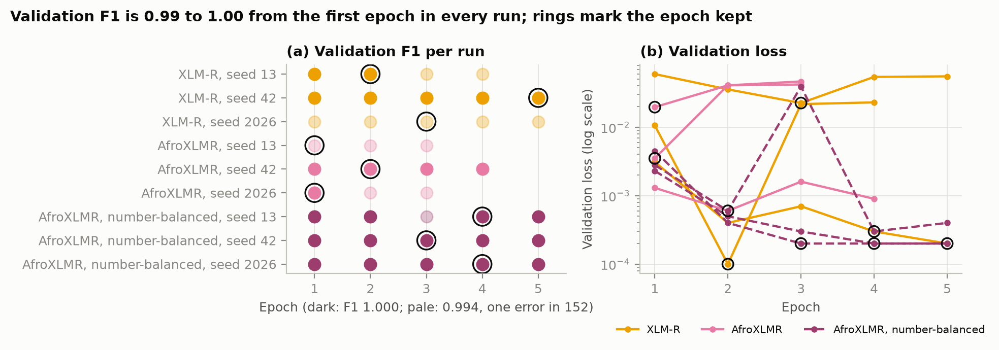

# Results

Template-disjoint split (no scam script in both train and test). Full tables for every experiment, with significance tests: [results/tables.md](../results/tables.md).

<!-- RESULTS:START -->
| Model | Test F1 | 95% CI | Test F1 (per template) | Test PR-AUC | Precision | Recall | Chichewa F1 (zero-shot) | Chichewa PR-AUC |
|---|---|---|---|---|---|---|---|---|
| Majority class | 0.695 | [0.62, 0.76] | 0.585 | 0.533 | 0.533 | 1.000 | 0.629 | 0.458 |
| Phone rule | 0.744 | [0.66, 0.82] | 0.969 | 0.810 | 1.000 | 0.593 | 0.681 | 0.692 |
| Length rule | 0.850 | [0.79, 0.90] | 0.774 | 0.747 | 0.752 | 0.975 | 0.724 | 0.573 |
| Naive Bayes, word counts | 0.982 | [0.96, 1.00] | 0.971 | 1.000 | 0.964 | 1.000 | 0.608 | 0.648 |
| Naive Bayes, char 2-5 | 0.953 | [0.91, 0.98] | 0.926 | 0.991 | 0.910 | 1.000 | 0.683 | 0.738 |
| Log. regression, word 1-2 | 0.981 | [0.96, 1.00] | 0.990 | 1.000 | 1.000 | 0.963 | 0.456 | 0.727 |
| Log. regression, char 2-5 | 0.968 | [0.94, 0.99] | 1.000 | 1.000 | 1.000 | 0.938 | 0.651 | 0.730 |
| BiLSTM, random init | 0.772 ± 0.014 | [0.69, 0.84] | 0.983 ± 0.011 | 0.942 ± 0.045 | 0.988 ± 0.021 | 0.634 ± 0.029 | 0.572 ± 0.147 | 0.744 ± 0.011 |
| BiLSTM, fastText frozen | 0.756 ± 0.009 | [0.67, 0.83] | 0.977 ± 0.015 | 0.890 ± 0.067 | 0.975 ± 0.029 | 0.617 ± 0.000 | 0.752 ± 0.008 | 0.751 ± 0.039 |
| BiLSTM, fastText fine-tuned | 0.763 ± 0.000 | [0.68, 0.84] | 0.990 ± 0.000 | 0.980 ± 0.003 | 1.000 ± 0.000 | 0.617 ± 0.000 | 0.750 ± 0.011 | 0.800 ± 0.023 |
| XLM-R base | 0.759 ± 0.007 | [0.67, 0.83] | 0.983 ± 0.011 | 0.871 ± 0.035 | 0.987 ± 0.022 | 0.617 ± 0.000 | 0.717 ± 0.012 | 0.654 ± 0.090 |
| AfroXLMR base | 0.776 ± 0.021 | [0.70, 0.84] | 0.990 ± 0.000 | 0.958 ± 0.038 | 1.000 ± 0.000 | 0.634 ± 0.029 | 0.719 ± 0.019 | 0.805 ± 0.042 |
| AfroXLMR base, number-balanced (E11) | 0.820 ± 0.035 | [0.75, 0.88] | 0.990 ± 0.000 | 0.985 ± 0.015 | 1.000 ± 0.000 | 0.696 ± 0.050 | 0.716 ± 0.033 | 0.649 ± 0.005 |
| Ensemble: char LR OR AfroXLMR | 0.968 ± 0.000 | [0.94, 0.99] | 1.000 ± 0.000 | 1.000 ± 0.000 | 1.000 ± 0.000 | 0.938 ± 0.000 | 0.720 ± 0.018 | 0.805 ± 0.043 |
| Ensemble: char LR OR number-balanced AfroXLMR | 0.968 ± 0.000 | [0.94, 0.99] | 1.000 ± 0.000 | 1.000 ± 0.000 | 1.000 ± 0.000 | 0.938 ± 0.000 | 0.737 ± 0.017 | 0.648 ± 0.005 |
| Ensemble: number-balanced char LR OR number-balanced AfroXLMR | 0.994 ± 0.000 | [0.98, 1.00] | 0.990 ± 0.000 | 0.996 ± 0.001 | 0.988 ± 0.000 | 1.000 ± 0.000 | 0.715 ± 0.034 | 0.642 ± 0.005 |
<!-- RESULTS:END -->

## Figures

## Experiments

| ID | Question | What changes | Main metric | Result |
| --- | --- | --- | --- | --- |
| E1 | Baseline | NB word counts, published setup | accuracy, scam F1 | 0.9868 accuracy (published: 98.7%), F1 0.991 |
| E2 | RQ1 leakage | random vs template split, 1 and 10 re-drawn splits | drop in scam F1 | char models lose 2.6-5.7 points, word models about 1 or less; all significant |
| E3 | Features | word vs char n-grams; masking on vs off | scam F1 | word features score highest on this data; masking changes little in Swahili |
| E3b | Shortcuts | phone rule, length rule, placeholders deleted | scam F1 | the rules alone reach test F1 0.74 and 0.85; without placeholders, classical Chichewa transfer collapses (char LR 0.65 → 0.11) |
| E4 | Embeddings | BiLSTM random / frozen / fine-tuned fastText | scam F1, mean ± sd | 0.76-0.77 for all three, each missing the landlord script; pretrained vectors raise Chichewa F1 (0.75 vs 0.57) and fine-tuned vectors rank Chichewa fraud best (PR-AUC 0.80 vs 0.74) |
| E5 | Transformers | XLM-R vs AfroXLMR, 3 seeds | scam F1, mean ± sd | 0.76 ± 0.01 vs 0.78 ± 0.02 (difference not significant, p = 0.39); both miss nearly all of the landlord script (at most 4 of 31 in any seed) |
| E6 | RQ2 attacks | 3 attacks × 3 intensities, every rung; disguised-genuine controls; a second attacker | relative F1 drop, control false alarms | word LR loses 53% under full lookalike, char LR 21-24% under lookalike and split words; transformers lose nothing but flag 54-93% of fully disguised genuine texts; same picture with the second attacker |
| E7 | RQ2 defences | normalisation; adversarial training (12% machine-made copies); held-out lookalikes the defence was not written for | relative F1 drop | normalisation: word LR 53% → 1% loss under lookalike, but 45% → 45% under held-out lookalikes (no recovery for any model); adversarial training: char LR code-switch loss 19% → 4% |
| E8 | RQ3 transfer | Swahili-trained rungs on Chichewa | fraud F1, PR-AUC | trained models 0.46-0.75 (phone rule 0.68, length rule 0.72); AfroXLMR PR-AUC 0.81 vs XLM-R 0.65 (p < 0.001); fastText BiLSTM 0.80 |
| E9 | RQ3 few-shot | + 20 / 50 Chichewa messages, scored on the same messages | fraud F1 | char LR 0.65 → 0.82 → 0.88; AfroXLMR 0.72 → 0.75 → 0.87; XLM-R 0.72 → 0.70 → 0.78 (AfroXLMR vs XLM-R p < 0.001; char LR vs AfroXLMR n.s.) |
| E10 | Shortcut diagnosis | minimal pairs: + number on genuine, − number on scams | false alarms, misses | AfroXLMR 96% / 20%; XLM-R 40% / 15%; BiLSTM 28% / 2%; char LR 15% / 2%; word LR 1% / 2% |
| E11 | Shortcut fix | number-balanced counterfactual training | stress tests, F1 everywhere | AfroXLMR 0% / 2%, BiLSTM 0% / 0%; AfroXLMR test PR-AUC 0.958 → 0.985 (F1 0.78 → 0.82, n.s.), Chichewa precision -0.06; char LR weaker under lookalike; BiLSTM weaker under code-switching and on Chichewa |
| E12 | Combination | char LR OR AfroXLMR (plain and number-balanced), chosen on validation; 2 fresh splits; 2 attackers | scam F1 | deployed (both number-balanced): test 0.994, lookalike 0.963, split words 0.948; fresh splits 0.994 and 0.988; +0.18-0.23 over char LR under attack (p < 0.001 where tested) |

## Error analysis

Every error of the main runs is sorted into a bucket by `src/errors.py` ([results/error_buckets.csv](../results/error_buckets.csv); two examples per bucket in [notebooks/07_errors.ipynb](../notebooks/07_errors.ipynb)). Bucket names describe the message, not a proven cause.

| Bucket | Typical message | What the evidence says |
| --- | --- | --- |
| Impersonation missed | *"Habari za asubuhi. Mimi mwenye nyumba wako hii namba yangu ya Vodacom. Mbona kimya ...?"* (landlord, "this is my new number") | No number, amount or link; the money request comes later in the conversation. Its words occur only in training scams (*namba yangu* in 49, *mwenye nyumba* in 9), so word NB (31 of 31) and word LR (29 of 31) catch it; the plain transformers do not (0-13% caught). The BiLSTMs miss nearly all of it too (at most 4 of 31 in any run). AfroXLMR scores it 0.000, and 0.985 once a number is appended. Number-balanced training helps AfroXLMR a little (6-32%) and the BiLSTM not at all. |
| Obfuscation missed | *"Іyo p3sа іtumе kwenyе n a m b a hii ..."* | Disguised words become unseen tokens. Normalisation fixes the lookalikes it was written for, only partly split words, and neither code-switching nor lookalike characters outside its table. |
| Telco service text flagged | Chichewa balance and bundle messages | BongoScam has no genuine service texts. AfroXLMR flags 67% ± 20% of Chichewa telco texts but 17% ± 4% of other genuine Chichewa texts (3 seeds). |
| Chichewa fraud missed | Malawian scams, e.g. DODMA flood relief and "Foundation" grants | Some scripts are national, but only 14 of the 116 Chichewa frauds AfroXLMR misses (seed 42) are such local schemes; most are ordinary money requests in an unseen language. |
| Ambiguous | very short texts | Need sender or conversation context. |

## Limitations

* **Small, easy data with undocumented provenance.** 1,064 Swahili messages; the genuine texts read like composed chat, and two shortcuts (numbers, length) separate the classes. In-language scores overstate real-world performance.
* **One split for most neural comparisons.** Validation F1 saturates, so neural comparisons rest on one template-disjoint test set (152 messages) dominated by one script. We add per-template views, bootstrap intervals, significance tests and two fresh splits for the transformer and the ensemble, but not ten re-drawn splits for every neural model.
* **Attacks.** The main trigger words come from a char-LR attacker (white-box for a char LR); a second, Naive Bayes attacker gives the same picture but changes only 84% of scams. Adversarial training uses the same attack code, and the normalisation table covers the attack's characters, so E7 measures robustness to known tricks: on held-out lookalikes normalisation recovers nothing. Transformers resist disguise largely by flagging odd text, including genuine text.
* **Chichewa.** The fraud set is partly rewritten by its authors and originals are not marked; our masking rules were written after looking at both datasets.
* **Post-hoc ensemble and a test-informed tuning revision.** The ensemble idea came from test-set errors (fresh splits and validation-based selection reduce but do not remove that bias), and one change of the classical tuning protocol was prompted by a test result.
* **No sender metadata or conversation context,** which impersonation scams need.
